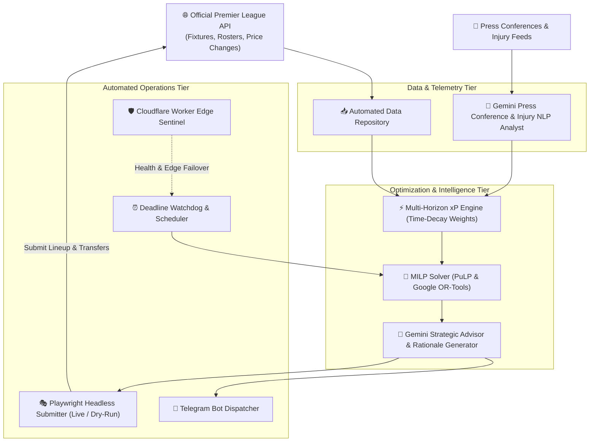

<div align="center">

# ⚽ FPL Autonomous AI Manager (`fantasy_ai`)

### Autonomous Fantasy Premier League Squad Manager Powered by Gemini AI & Mathematical Optimization

[](https://www.python.org/)
[](https://ai.google.dev/)
[](https://coin-or.github.io/pulp/)
[](https://developers.google.com/optimization)
[](https://playwright.dev/)
[](https://workers.cloudflare.com/)
[](https://telegram.org/)
[](LICENSE)

**Linear Programming Solver • Multi-Horizon xP Decay • Press Conference NLP • Autonomous FPL Live Submissions**

[System Architecture](#-system-architecture) • [Core Capabilities](#-core-capabilities) • [Mathematical Optimization](#-mathematical-solver--xp-engine) • [Quick Start](#-installation--quick-start)

</div>

---

## 🎯 Overview

**FPL Autonomous AI Manager** is an end-to-end intelligent squad management system engineered to automate decision-making in Fantasy Premier League (FPL).

By combining **Mixed Integer Linear Programming (MILP)** with **Google Gemini Large Language Models**, the platform eliminates human emotional bias. It solves mathematical team knapsacks over multi-gameweek horizons, synthesizes press conference injury reports via NLP, optimizes captaincy picks, and automatically executes optimal transfers and starting lineups directly onto the official FPL platform via headless automation.

---

## 🏗 System Architecture



---

## 🌟 Core Capabilities

- 🤖 **Fully Autonomous Squad Management:** Automatically ingests gameweek fixture difficulty (FDR), player injury status, historical home/away performance, and market price changes without manual inputs.
- 🧮 **Mixed-Integer Linear Programming (MILP):** Formulates squad selection as a constrained knapsack problem (100.0M budget, max 3 players per club, valid formations 3-5-2, 3-4-3, 4-3-3, 4-4-2).
- 📈 **Multi-Horizon Expected Points (xP):** Evaluates player utility across a rolling 3-to-5 gameweek window utilizing geometric decay multipliers to prioritize immediate returns while preserving structural squad longevity.
- 🔍 **Press Conference NLP Analysis:** Leverages **Google Gemini** to extract sentiment, press conference quotes, rotation risks, and subtle injury signals that standard statistics miss.
- 🎭 **Headless Live / Dry-Run Execution:** Supports dry-run simulation mode for safety, or full headless Playwright execution to automatically log in, submit transfers, and adjust starting 11 before deadlines.
- 📱 **Real-Time Telegram Intelligence:** Dispatches rich gameweek briefing reports, tactical transfer justifications, captaincy recommendations, and chip timing directly to Telegram.

---

## 🧮 Mathematical Solver & xP Engine

The mathematical solver maximizes total expected points ($xP$) subject to official FPL constraints:

$$\max \sum_{i \in \text{Players}} \sum_{w=1}^{H} \gamma^{w-1} \cdot xP_{i,w} \cdot x_{i,w} - \text{Cost}(\text{Hits})$$

Where:
- $H$ is the planning horizon (e.g., 3 weeks).
- $\gamma$ is the time-decay factor (default: $0.85$).
- Constraints enforce team budget $\le 100.0\text{M}$, exactly 15 squad members (2 GK, 5 DEF, 5 MID, 3 FWD), and $\le 3$ players per Premier League club.

---

## 💻 Installation & Quick Start

### 1. Prerequisites
- **Python 3.10+**
- Google Gemini API Key

### 2. Setup Environment
```bash
# Clone the repository
git clone https://github.com/3bkader-gpt/fantasy_ai.git
cd fantasy_ai

# Setup virtual environment
python -m venv .venv

# On Linux/macOS:
source .venv/bin/activate
# On Windows:
.venv\Scripts\activate

# Install dependencies
pip install -r requirements.txt
```

### 3. Configuration (`.env`)
Create a `.env` file based on `.env.example`:
```ini
# Google Gemini API
GEMINI_API_KEY=your_gemini_api_key_here
GEMINI_MODEL=gemini-2.0-flash

# Fantasy Premier League Credentials
FPL_EMAIL=your_email@example.com
FPL_PASSWORD=your_password
FPL_TEAM_ID=123456

# Operational Mode
DRY_RUN=True
HORIZON_WEEKS=3

# Telegram Notifications
TELEGRAM_BOT_TOKEN=your_telegram_bot_token
TELEGRAM_CHAT_ID=your_chat_id
```

### 4. Running the Optimization
```bash
# Execute single-gameweek tactical analysis
python main.py

# Run pure AI evaluation
python run_pure_ai.py

# Run test suite
pytest tests/ -v
```

---

## 📄 License

This project is licensed under the [MIT License](LICENSE).
